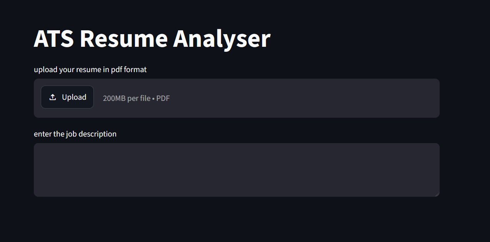
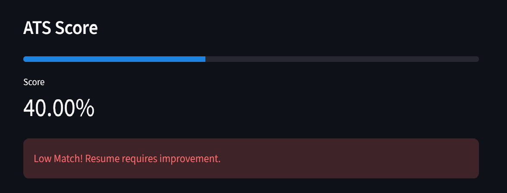
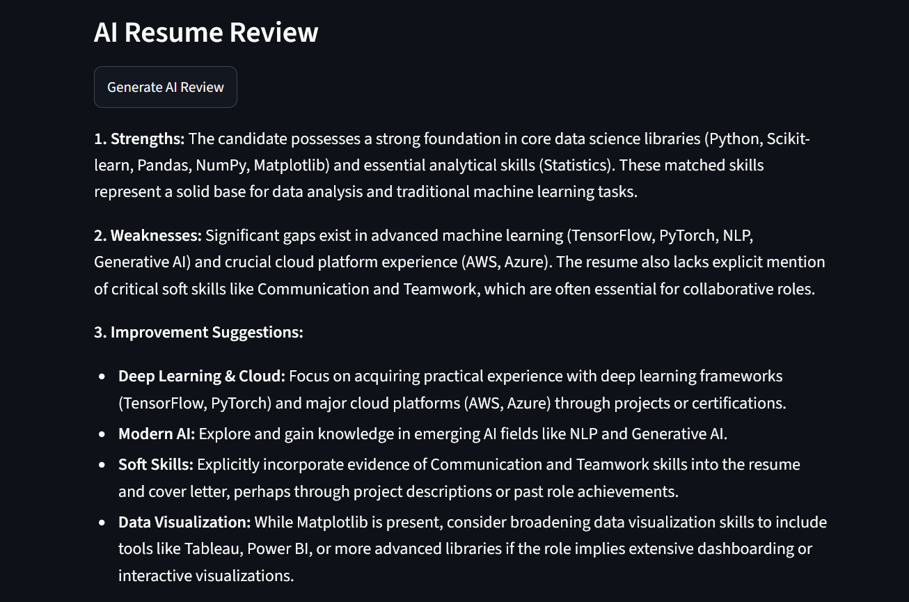
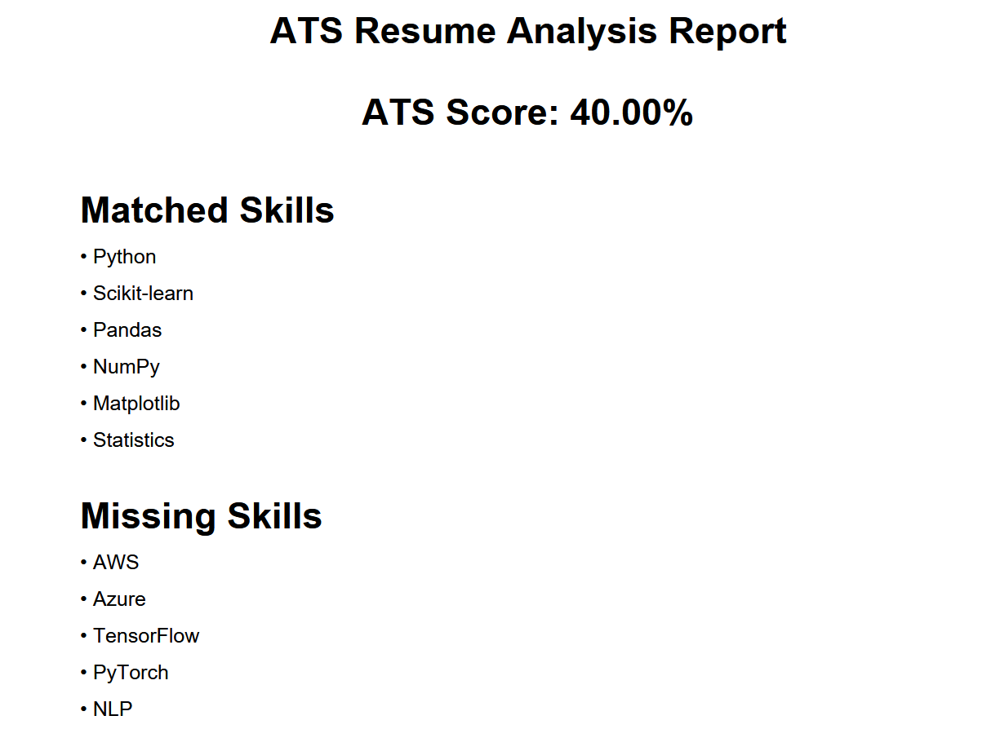

# ATS Resume Analyzer

[](https://ats-resume-analyzer-hrhv8e5yryqtm2an4jzplp.streamlit.app)

AI-powered ATS Resume Analyzer built using Streamlit and Google Gemini API.

## Features

* ATS Resume Score Calculation
* Resume & Job Description Matching
* Semantic Similarity Analysis
* AI Resume Review using Gemini
* Personalized Learning Roadmap
* Resume Rewrite Suggestions
* PDF Report Generation
* Cloud Deployment via Streamlit

## Screenshots

### Home Page



### ATS Analysis



### AI Review



### PDF Report



## Tech Stack

* Python
* Streamlit
* Google Gemini API
* Sentence Transformers
* Pandas
* RapidFuzz
* ReportLab
* PDFPlumber

## Installation

```bash
git clone https://github.com/sjgupta195-cloud/ATS-Resume-Analyzer.git
cd ATS-Resume-Analyzer
pip install -r requirements.txt
streamlit run app.py
```

## Deployment

Deployed on Streamlit Cloud.

## Author

Suraj Gupta
